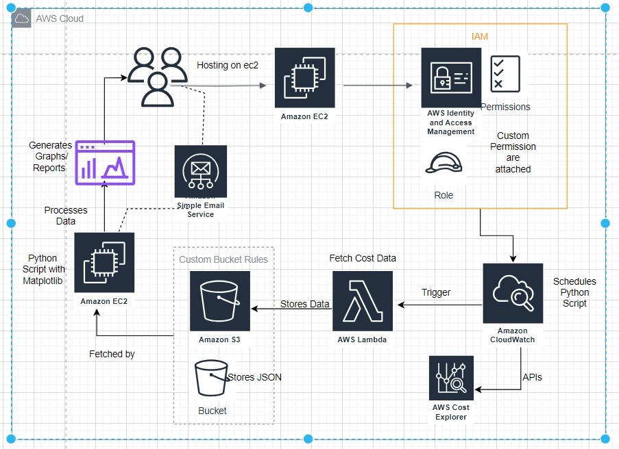

# AWS Cost Optimizer & Predictor 🚀

A fully automated AWS cost monitoring solution using S3, Lambda, CloudWatch, and Python visualization (Matplotlib/Pandas). This project extracts cost usage data, stores it in S3, processes it with Lambda, and visualizes it in Colab.

## Features

- ✔ Automated Cost Data Extraction – Uses AWS Lambda & CloudWatch to schedule daily cost report generation.
- ✔ Secure Storage – Cost reports are stored in an S3 bucket.
- ✔ Data Processing & Visualization – Python-based analysis with Matplotlib & Pandas.
- Cost Optimization Strategy – Can be upgraded with AWS Athena, QuickSight, or Grafana.

## 🛠 Architecture Overview
- 🚀 Free-Tier Optimized Approach (Implemented)
- 1️⃣ AWS Cost Explorer – Generates historical cost data (No forecasting).
- 2️⃣ AWS Lambda – Fetches cost data via Boto3 SDK.
- 3️⃣ Amazon S3 – Stores extracted reports.
- 4️⃣ CloudWatch Scheduler – Automates Lambda execution daily.
- 5️⃣ Google Colab – Processes and visualizes cost data using Python (Matplotlib, Pandas).
- 

## 🔍 Alternative Approach (If Not Limited by Free Tier 💸)
If we weren’t restricted to free-tier services, we could use:
- ✅ AWS Athena – Query S3 cost data instead of Colab.
- ✅ Amazon QuickSight – Professional dashboards instead of Matplotlib.
- ✅ Amazon Grafana – Live visualization with AWS CloudWatch integration.
- ✅ AWS EC2 – Runs Python scripts directly instead of using Google Colab.

## 📌 How It Works

1️⃣ Setup AWS Services
- Enable Cost Explorer in AWS.
- Create an S3 bucket for storing cost reports.
- Create an IAM role with S3 and Cost Explorer access.
2️⃣ Automate Data Collection
- Deploy an AWS Lambda function to extract cost data.
- Schedule Lambda execution using CloudWatch 
- Scheduler (Daily run).
3️⃣ Process & Visualize Cost Data
- Download cost reports from S3.
- Use Python (Pandas, Matplotlib) for visualization in Google Colab.

## 📌 Deployment Guide

1️⃣ Upload Lambda Code to AWS
- Install AWS SDK:

```bash
  pip install boto3
```
- Deploy Lambda function:
```python
  import boto3

  def lambda_handler(event, context):
    client = boto3.client('ce')
    response = client.get_cost_and_usage(
        TimePeriod={'Start': '2024-03-01', 'End': '2024-03-31'},
        Granularity='DAILY',
        Metrics=['AmortizedCost']
    )
    print(response)

```
2️⃣ Automate Execution with CloudWatch
- Create a CloudWatch Scheduler with a daily cron job
```txt
  cron(0 0 * * ? *)
```
3️⃣ Visualize Cost Data in Google Colab
- Install required Python libraries
```python
import pandas as pd
import matplotlib.pyplot as plt
```
- Load cost data from S3 & plot graphs
```python
df = pd.read_json("s3://your-bucket-name/cost-data.json")
df.plot(kind="bar")
plt.show()
```

## 📸 Screenshots & Results

- 🔹 CloudWatch Scheduler: (Automates Lambda Execution)


- 🔹 S3 Cost Reports: (Stores JSON Reports)


- 🔹 Matplotlib Graphs: (Visualized Cost Trends)


## 📌 Future Enhancements

- ✅ Athena for Querying Cost Data
- ✅ Grafana for Live Cost Monitoring
- ✅ QuickSight for Advanced Reports
- ✅ EC2 for Running Python Code Instead of Colab

## 📌 Contributing

🙌 Feel free to fork this repo, improve the automation, and submit a PR!

## 📌 Contact & Support

Have questions? Open an issue on GitHub or reach out! 🚀

## 🌟 Star This Repo If You Found It Useful! ⭐
